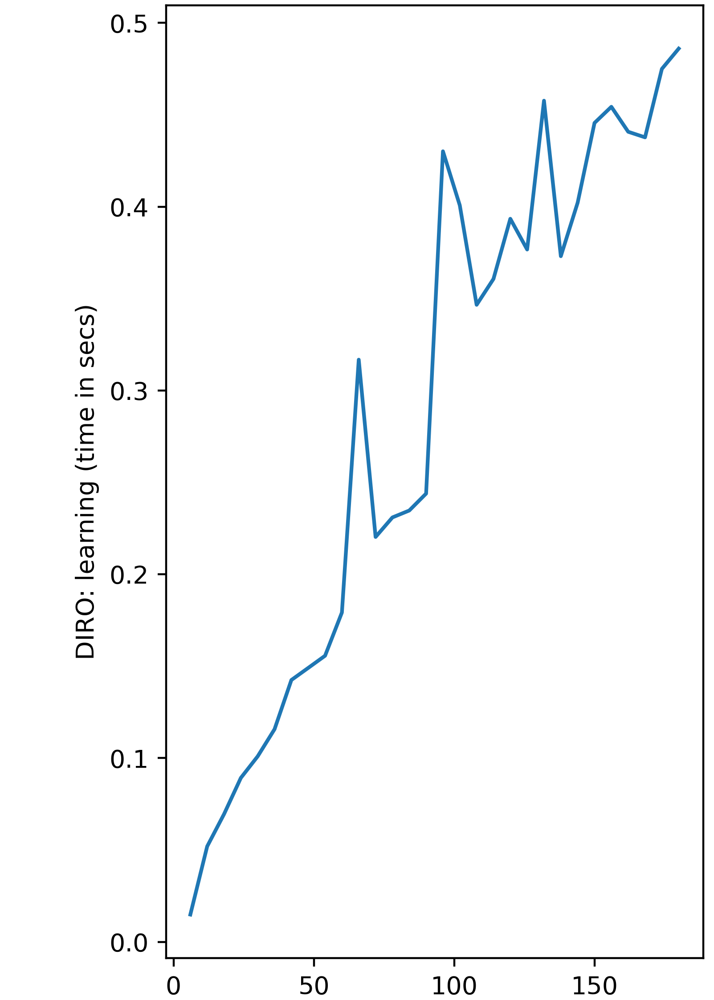

## Graphs and Analysis

Let  

<pre>
<code>
N  = number of training samples,  
k  = number of features, and  
d  = depth of the decision tree
</pre>
</code>

In general, a decision tree calculates a criteria function for each feature and every sample to decide split on data by optimising the criterion function. This happens on every node which is not a leaf node. Also, this continues untill a certain depth. 

For a balanced tree, the depth would be O(logN). But the worst case would be the O(N) which is highly likely as the split is not based on balance of decision tree. 

Hence, the theotrical worst case time complexity would be O(Nkd)

Experimentally it was seen that the time complexity comes out to be approx O(log(N)k)

This is due to the uncertainty in algorithm to make decision tree. Because it splits locally based on greedy approach.

