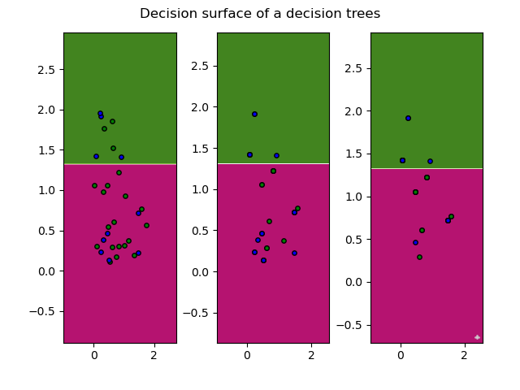
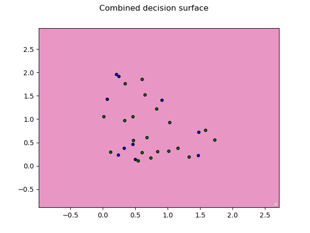

## ADABoost

#### Results 

<pre>
<code>

* Criteria : information_gain
* Accuracy:  73.33333333333333
* Precision:  100.0
* Recall:  20.0
* Precision:  71.42857142857143
* Recall:  100.0

</code>
</pre>

#### ADABoost plot for individual estimators

#### ADABoost plot for combined estimator

#### Results for iris dataset

<pre>
<code>

Accuracy: 35.0
Precision for Iris-versicolor  :  35.0
Recall for  Iris-versicolor :  100.0
Precision for Iris-setosa  :  None
Recall for  Iris-setosa :  0.0
Precision for Iris-virginica  :  None
Recall for  Iris-virginica :  0.0

</code>
</pre>