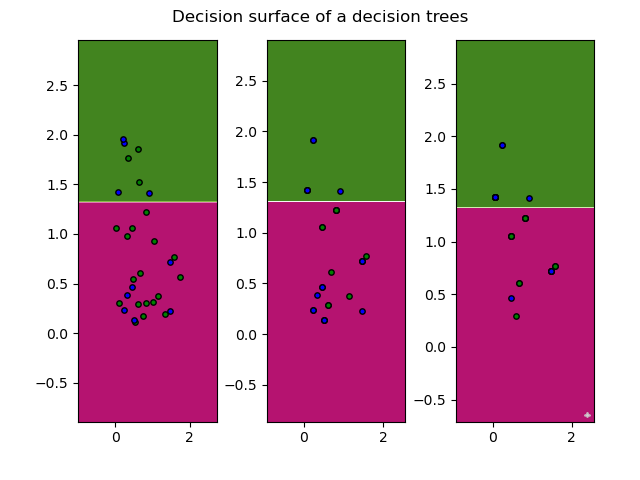
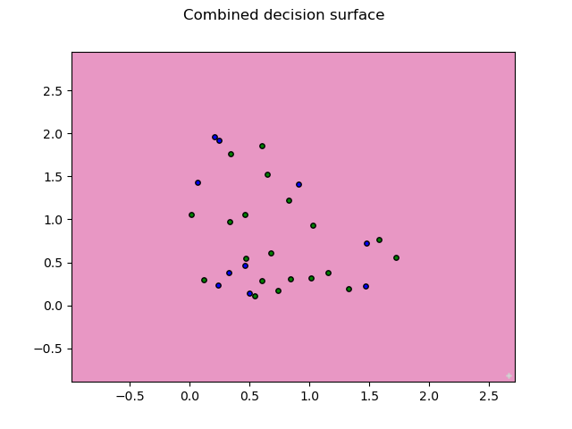

# ES654-2020 Assignment 1

*Shruti Katpara* - *18110084*

##  RESULTS

### IRIS Data
#### Shuffled 70-30 split:

<pre>
<code>
~~~~~~~~~~~~~~~~~~~~~~~~~~~~~~~~~~~~~~~~~~~~~~~~

Accuracy 40.0
Precision:  Iris-versicolor  :  37.93103448275862
Recall:  Iris-versicolor  :  100.0
Precision:  Iris-setosa  :  100.0
Recall:  Iris-setosa  :  14.285714285714285
Precision:  Iris-virginica  :  None
Recall:  Iris-virginica  :  0.0

~~~~~~~~~~~~~~~~~~~~~~~~~~~~~~~~~~~~~~~~~~~~~~~~
</code>
</pre>

#### 5-fold Cross Validation
<pre>
<code>
~~~~~~~~~~~~~~~~~~~~~~~~~~~~~~~~~~~~~~~~~~~~~~~~

Five Fold Cross Validation
Individual Accuracies:
40.0 63.33333333333333 26.666666666666668 36.666666666666664 26.666666666666668
Average Accuracy:
38.666666666666664

~~~~~~~~~~~~~~~~~~~~~~~~~~~~~~~~~~~~~~~~~~~~~~~~
</code>
</pre>

#### Nested-Cross Validation

### Real_Estate_data:

<pre>
<code>

$$$$$$$$$$$$$$$$$$$$$$$$$$$$$$$$$$$$$$$$$$$$$$$$$$$$$$$

1) using sklearn: 
using RMSE score and MAE score respectively
5.933596970583332
6.747121206730561

2) using my decision tree:
using RMSE score and MAE score respectively
8.257620944793983
6.411176238095239

$$$$$$$$$$$$$$$$$$$$$$$$$$$$$$$$$$$$$$$$$$$$$$$$$$$$$$$

</pre>
</code>

## Graphs and Analysis

## ADABoost

#### Results 

<pre>
<code>

* Criteria : information_gain
* Accuracy:  73.33333333333333
* Precision:  100.0
* Recall:  20.0
* Precision:  71.42857142857143
* Recall:  100.0

</code>
</pre>

#### ADABoost plot for individual estimators

#### ADABoost plot for combined estimator

#### Results for iris dataset

<pre>
<code>

Accuracy: 35.0
Precision for Iris-versicolor  :  35.0
Recall for  Iris-versicolor :  100.0
Precision for Iris-setosa  :  None
Recall for  Iris-setosa :  0.0
Precision for Iris-virginica  :  None
Recall for  Iris-virginica :  0.0

</code>
</pre>

## Bagging Results

<pre>
<code>
Criteria : information_gain
Accuracy:  93.33333333333333
Precision:  90.0
Recall:  90.0
Precision:  95.0
Recall:  95.0

</pre>
</code>

#### Bagging plot for individual estimators

#### Bagging plot for combined estimator

## Random Forest Results

#### Classifier Results

<pre>
<code>

Criteria : information_gain
Accuracy:  96.66666666666667
Precision:  90.0
Recall:  100.0
Precision:  100.0
Recall:  100.0
Precision:  100.0
Recall:  100.0
Precision:  100.0
Recall:  100.0
Precision:  100.0
Recall:  66.66666666666666  
Criteria : gini_index
Accuracy:  93.33333333333333
Precision:  100.0
Recall:  100.0
Precision:  100.0
Recall:  100.0
Precision:  100.0
Recall:  85.71428571428571
Precision:  75.0
Recall:  75.0
Precision:  75.0
Recall:  100.0

</pre>
</code>

#### Regression Results

<pre>
<code>
Criteria : variance
RMSE:  0.739362525546805
MAE:  0.5881589837723745

</pre>
</code>

## Random Forest for IRIS dataset

#### Results

<pre>
<code>

Accuracy: 91.66666666666666
Precision for Iris-versicolor  :  80.76923076923077
Recall for  Iris-versicolor :  100.0
Precision for Iris-setosa  :  100.0
Recall for  Iris-setosa :  100.0
Precision for Iris-virginica  :  100.0
Recall for  Iris-virginica :  79.16666666666666
</pre>
</code>

